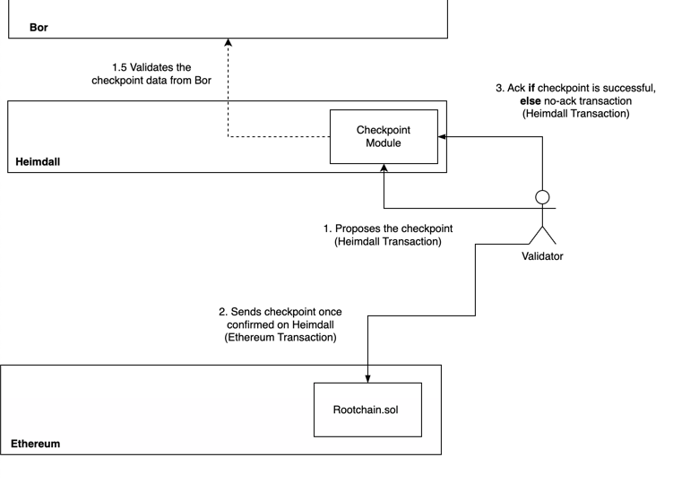

<!-- TODO HV2 - update/verify the models, query, cli, and REST behaviour -->

# Checkpoint

Heimdall selects the next proposer using Peppermint’s leader selection algorithm.  
The multi-stage checkpoint process is crucial due to potential failures when submitting checkpoints on the Ethereum chain caused by factors like gas limit, network traffic, or high gas fees.
Each checkpoint has a validator as the proposer.  
The outcome of a checkpoint on the Ethereum chain (success or failure) triggers an ack (acknowledgment) or no-ack (no acknowledgment) transaction,  
altering the proposer for the next checkpoint on Heimdall. 



## Messages

### MsgCheckpoint

`MsgCheckpoint` defines a message for creating a checkpoint on the Ethereum chain.

```protobuf
message MsgCheckpoint {
option (cosmos.msg.v1.signer) = "proposer";
option (amino.name) = "checkpoint/MsgCheckpoint";

option (gogoproto.equal) = true;
option (gogoproto.goproto_getters) = true;

string proposer = 1 [
(amino.dont_omitempty) = true,
(cosmos_proto.scalar) = "cosmos.AddressString"
];

uint64 start_block = 2 [ (amino.dont_omitempty) = true ];

uint64 end_block = 3 [ (amino.dont_omitempty) = true ];

bytes root_hash = 4 [ (amino.dont_omitempty) = true ];

bytes account_root_hash = 5 [ (amino.dont_omitempty) = true ];

string bor_chain_id = 6 [ (amino.dont_omitempty) = true ];
}
```

### MsgCheckpointAck

`MsgCheckpointAck` defines a message for creating the ack tx of a submitted checkpoint.

```protobuf
message MsgCheckpointAck {
option (cosmos.msg.v1.signer) = "from";
option (amino.name) = "checkpoint/MsgCheckpointAck";

option (gogoproto.equal) = false;
option (gogoproto.goproto_getters) = true;

string from = 1 [
(amino.dont_omitempty) = true,
(cosmos_proto.scalar) = "cosmos.AddressString"
];

uint64 number = 2 [ (amino.dont_omitempty) = true ];

string proposer = 3 [
(amino.dont_omitempty) = true,
(cosmos_proto.scalar) = "cosmos.AddressString"
];

uint64 start_block = 4 [ (amino.dont_omitempty) = true ];

uint64 end_block = 5 [ (amino.dont_omitempty) = true ];

bytes root_hash = 6 [ (amino.dont_omitempty) = true ];

bytes tx_hash = 7 [ (amino.dont_omitempty) = true ];

uint64 log_index = 8 [ (amino.dont_omitempty) = true ];
}
```

### MsgCheckpointNoAck

`MsgCheckpointNoAck` defines a message for creating the no-ack tx of a checkpoint.

```protobuf
message MsgCheckpointNoAck {
option (cosmos.msg.v1.signer) = "from";

option (amino.name) = "checkpoint/MsgCheckpointNoAck";

option (gogoproto.equal) = false;
option (gogoproto.goproto_getters) = true;

string from = 1 [
(amino.dont_omitempty) = true,
(cosmos_proto.scalar) = "cosmos.AddressString"
];
}
```

## CLI Commands

### Send checkpoint

```bash
heimdallcli tx checkpoint send-checkpoint \
 --proposer=<proposer-address> \
 --start-block=<start-block> \
 --end-block=<end-block> \
 --root-hash=<root-hash> \
 --account-root-hash=<account-root-hash> \
 --bor-chain-id=<bor-chain-id>
```

### Send checkpoint ack

```bash
heimdallcli tx checkpoint send-ack \
 --proposer=<proposer-address> \
 --tx-hash=<checkpoint-tx-hash>
 --log-index=<checkpoint-event-log-index>
 --header=<checkpoint-index> \
 --chain-id=<chain-id>
```

### Send checkpoint no-ack

```bash
heimdallcli tx checkpoint send-noack --chain-id <chain-id>
```

## REST APIs

### Post checkpoint ack

```bash
curl -X POST ...
```
