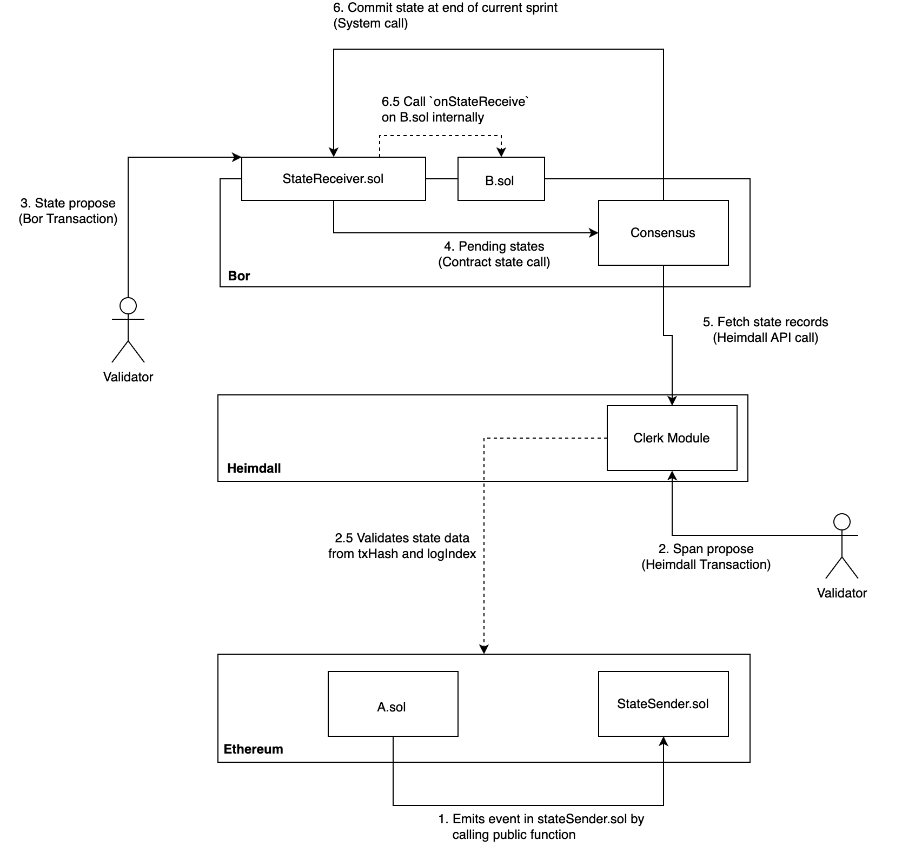

[//]: # (TODO HV2: https://polygon.atlassian.net/browse/POS-2757)

# Clerk module

## Table of Contents

* [Preliminary terminology](#preliminary-terminology)
* [Overview](#overview)
* [State-Sync Mechanism](#state-sync-mechanism)
* [How does it work](#how-does-it-work)
* [How to add an event](#how-to-add-an-event)
* [Query commands](#query-commands)

## Preliminary terminology

* A `StateSender` is a contract deployed on L1 (Ethereum) responsible for emitting state-sync events.
* A `StateReceiver` is a contract deployed on L2 (Bor) responsible for receiving state-sync events.
* A `EventRecord` is a record of the state-sync event stored in the heimdall state.

## Overview

Clerk manages generic event records from Ethereum blockchain related to state-sync events, These are specially designed events that are emitted by the StateSender contract on the L1 chain to notify the L2 nodes (Bor in case of PoS) about the state changes in the L1. Once the events are processed by the bridge, Clerk listens to these events and stores them in the database for further processing.

## State-Sync Mechanism

It's a mechanism for state-management between Ethereum and Bor chain, The events generated are called state-sync events. This is a way to move data from the L1 chain to L2 chain.



## How does it work

An `EventRecord` is defined by the data structure :

```protobuf
message EventRecord {
  option (gogoproto.goproto_getters) = false;
  option (gogoproto.equal) = false;

  uint64 id = 1;
  string contract = 2 [
    (amino.dont_omitempty) = true,
    (cosmos_proto.scalar) = "cosmos.AddressString"
  ];
  bytes data = 3;
  string tx_hash = 4;
  uint64 log_index = 5;
  string bor_chain_id = 6;
  google.protobuf.Timestamp record_time = 7
  [ (gogoproto.stdtime) = true, (gogoproto.nullable) = false ];
}
```

* `id` is the unique identifier for the event record, Generated by the `StateSender` contract.
* `contract` is the address of the contract on the L2 chain on which the event will be processed.
* `data` is the data of the event which will be processed by the contract.
* `txHash` is the transaction hash of the event on the L1 chain.
* `logIndex` is the log index of the event on the L1 chain.
* `borChainID` is the chain id of the bor chain.
* `recordTime` is the time at which the event was recorded in heimdall state.

The bridge will listen to the state-sync events from L1 and generate a txn with `MsgEventRecord` which is responsible for validating events from `StateSender` contract and storing the `EventRecord` on the heimdall state for bor to use.

```protobuf
message MsgEventRecord {
  option (gogoproto.equal) = false;
  option (gogoproto.goproto_getters) = false;

  string from = 1 [
    (amino.dont_omitempty) = true,
    (cosmos_proto.scalar) = "cosmos.AddressString"
  ];
  string tx_hash = 2;
  uint64 log_index = 3;
  uint64 block_number = 4;
  string contract_address = 5 [
    (amino.dont_omitempty) = true,
    (cosmos_proto.scalar) = "cosmos.AddressString"
  ];
  bytes data = 6;
  uint64 id = 7;
  string chain_id = 8;
}
```

[Handler](keeper/msg_server.go) for this transaction validates for multiple conditions including `TxHash` and `LogIndex` to ensure that the event exists on L1 and the data is not tampered with, It throws `Older invalid tx found` error if the event is already processed.

Once the event is validated by the Handler, It will go to `SideHandleMsgEventRecord` in each validator node and after verifying the event, The validators will vote with either a `YES` return an error for a failed verification.

Only when there is a majority of `YES` votes, The event will be processed by `PostHandleMsgEventRecord` which will persist the event in the state via keeper.

## How to add an event

A validator can leverage the CLI to add an event to the state in case it's missing and not processed by the bridge, The CLI command is :

```bash
heimdallcli tx clerk record 
    --id <event-id>
    --contract <contract-address>
    --data <event-data>
    --tx-hash <tx-hash>
    --log-index <log-index>
    --block-number <L1-block-number>
    --bor-chain-id <bor-chain-id>
    --chain-id <heimdall-chain-id>
```

## Query commands

One can run the following query commands from the clerk module :

* `record` - Query for a specific event record.
* `list` - Query a list of event records.
* `isoldtx` - Query if the event record is already processed.


### CLI commands

```bash
heimdallcli query clerk record --id <event-id>
```

```bash
heimdallcli query clerk is-old-tx --tx-hash <tx-hash> --log-index <log-index>
```

### REST endpoints

```bash
curl -X GET "localhost:1317/clerk/event-record/<event-id>"
```

```bash
curl -X GET "localhost:1317/clerk/event-record/list?from-id=<from-id>&to-time=<time-in-unix>&limit=<limit>"
```

```bash
curl -X GET "localhost:1317/clerk/isoldtx?tx-hash=<tx-hash>&log-index=<log-index>"
```
