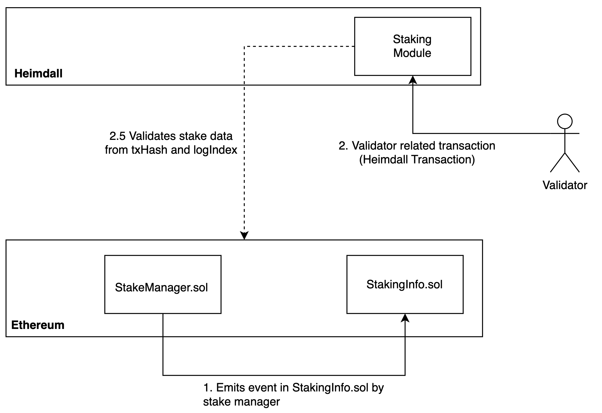

[//]: # (TODO HV2: https://polygon.atlassian.net/browse/POS-2757)

# Stake module

This module manages validators related transactions and state for Heimdall.  
validators stake their tokens on the Ethereum chain and send the transactions on Heimdall using necessary parameters to acknowledge the Ethereum stake change.  
Once the majority of the validators agree on the change on the stake, this module saves the validator information on Heimdall state.  



## Messages

### MsgValidatorJoin

`MsgValidatorJoin` defines a message for a node to join the network as validator.

Here is the structure for the transaction message:

```protobuf
message MsgValidatorJoin {
option (amino.name) = "heimdallv2/MsgValidatorJoin";

option (gogoproto.equal) = false;
option (gogoproto.goproto_getters) = true;

string from = 1 [
(amino.dont_omitempty) = true,
(cosmos_proto.scalar) = "cosmos.AddressString"
];
uint64 val_id = 2 [ (amino.dont_omitempty) = true ];
uint64 activation_epoch = 3 [ (amino.dont_omitempty) = true ];
string amount = 4 [
(gogoproto.nullable) = false,
(gogoproto.customtype) = "cosmossdk.io/math.Int",
(amino.dont_omitempty) = true
];
google.protobuf.Any signer_pub_key = 5
[ (cosmos_proto.accepts_interface) = "cosmos.crypto.PubKey" ];
bytes tx_hash = 6 [ (amino.dont_omitempty) = true ];
uint64 log_index = 7 [ (amino.dont_omitempty) = true ];
uint64 block_number = 8 [ (amino.dont_omitempty) = true ];
uint64 nonce = 9 [ (amino.dont_omitempty) = true ];
}
```

### MsgStakeUpdate

`MsgStakeUpdate` defines a message for a validator to perform a stake update on Ethereum network.

```protobuf
message MsgStakeUpdate {
option (amino.name) = "heimdallv2/MsgStakeUpdate";

option (gogoproto.equal) = false;
option (gogoproto.goproto_getters) = true;

string from = 1 [
(amino.dont_omitempty) = true,
(cosmos_proto.scalar) = "cosmos.AddressString"
];
uint64 val_id = 2 [ (amino.dont_omitempty) = true ];
string new_amount = 3 [
(gogoproto.nullable) = false,
(amino.dont_omitempty) = true,
(gogoproto.customtype) = "cosmossdk.io/math.Int"
];
bytes tx_hash = 4 [ (amino.dont_omitempty) = true ];
uint64 log_index = 5 [ (amino.dont_omitempty) = true ];
uint64 block_number = 6 [ (amino.dont_omitempty) = true ];
uint64 nonce = 7 [ (amino.dont_omitempty) = true ];
}
```

### MsgSignerUpdate

`MsgSignerUpdate` defines a message for updating the signer of the existing validator.

```protobuf
message MsgSignerUpdate {
  option (amino.name) = "heimdallv2/MsgSignerUpdate";

  option (gogoproto.equal) = false;
  option (gogoproto.goproto_getters) = true;

  string from = 1 [
    (amino.dont_omitempty) = true,
    (cosmos_proto.scalar) = "cosmos.AddressString"
  ];
  uint64 val_id = 2 [ (amino.dont_omitempty) = true ];
  google.protobuf.Any new_signer_pub_key = 3
      [ (cosmos_proto.accepts_interface) = "cosmos.crypto.PubKey" ];
  bytes tx_hash = 4 [ (amino.dont_omitempty) = true ];
  uint64 log_index = 5 [ (amino.dont_omitempty) = true ];
  uint64 block_number = 6 [ (amino.dont_omitempty) = true ];
  uint64 nonce = 7 [ (amino.dont_omitempty) = true ];
}
```

### MsgValidatorExit

`MsgValidatorExit` defines a message for a validator to exit the network.

```protobuf
message MsgValidatorExit {
option (amino.name) = "heimdallv2/MsgValidatorExit";

option (gogoproto.equal) = false;
option (gogoproto.goproto_getters) = true;

string from = 1 [
(amino.dont_omitempty) = true,
(cosmos_proto.scalar) = "cosmos.AddressString"
];
uint64 val_id = 2 [ (amino.dont_omitempty) = true ];
uint64 deactivation_epoch = 3 [ (amino.dont_omitempty) = true ];
bytes tx_hash = 4 [ (amino.dont_omitempty) = true ];
uint64 log_index = 5 [ (amino.dont_omitempty) = true ];
uint64 block_number = 6 [ (amino.dont_omitempty) = true ];
uint64 nonce = 7 [ (amino.dont_omitempty) = true ];
}
```

## CLI Commands
[//]: # (TODO:HV2 methods/commands not available in the heimdalld based heimdall-cli. Only `send-ack` and `send-checkopoint` are available)
### Validator join

```bash
heimdallcli tx stake validator-join \
 --proposer <proposer-address> \ 
 --signer-pubkey <signer-public-key> \
 --staked-amount <amount> \
 --tx-hash <tx-hash>   \
 --log-index <log-index> \
 --block-number <block-number> \ 
 --activation-epoch=<activation-epoch> \ 
 --chain-id <chain-id>
```

### Signer update

```bash
heimdallcli tx stake signer-update \
 --proposer <proposer-address> \ 
 --id <validator-id> \
 --signer-pubkey <signer-public-key> \
 --new-pubkey=<new-signer-pubkey> \
 --tx-hash <tx-hash>   \
 --log-index <log-index> \ 
 --block-number <block-number> \ 
 --nonce <nonce>
```

## REST APIs
[//]: # (TODO:HV2 check the endpoints below)

### Get validators set

```bash
curl -X 'GET' 'localhost:1317/stake/validator-set'
```

### Get validator details

```bash
curl -X 'GET'  'localhost:1317/stake/validator/<validator-id>' 
```

### Get signer by address

```bash
curl -X 'GET'  'localhost:1317/stake/signer/<validator-address>' 
```

### Get validator status by address

```bash
curl -X 'GET'  'localhost:1317/stake/validator-status/<validator-address>' 
```

### Get total power

```bash
curl -X 'GET'  'localhost:1317/stake/total-power' 
```

### Is stake transaction processed

```bash
curl -X 'GET'  'localhost:1317/stake/is-old-tx?tx_hash=<tx-hash>&log_index=<log-index>' 
```
